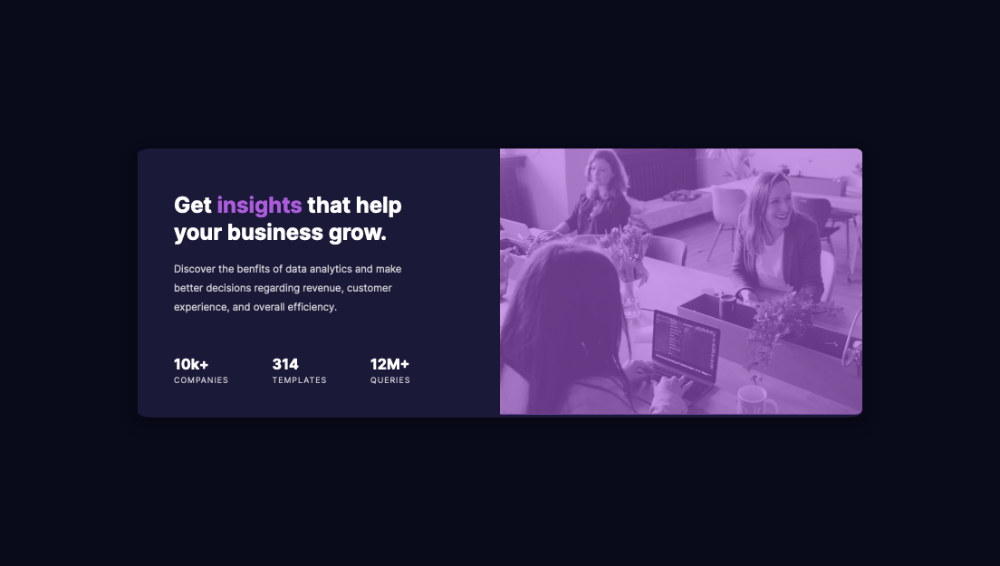

# Frontend Mentor - Stats preview card component solution

This is a solution to the [Stats preview card component challenge on Frontend Mentor](https://www.frontendmentor.io/challenges/stats-preview-card-component-8JqbgoU62).

## Table of contents

- [Overview](#overview)
  - [The challenge](#the-challenge)
  - [Screenshot](#screenshot)
  - [Links](#links)
- [My process](#my-process)
  - [Built with](#built-with)
  - [What I learned](#what-i-learned)
- [Author](#author)

## Overview

### The challenge

Users should be able to:

- View the optimal layout depending on their device's screen size

### Screenshot



### Links

- Solution URL: [Add solution URL here](https://github.com/siddhantsingh-1/stats-preivew-component)
- Live Site URL: [Add live site URL here](https://siddhantsingh-1.github.io/stats-preview-component)

## My process

### Built with

- Semantic HTML5 markup
- Sass Preprocessor
- Flexbox
- CSS Grid
- Mobile-first workflow

### What I learned

Here is how to add an overlay over an image

```html
<div class="banner">
	
</div>
```

```scss
.banner {
	width: 100%;
	position: relative;

	img {
		width: 100%;
		border-radius: 3% 3% 0 0;
	}

	&::after {
		content: "";
		width: 100%;
		height: 100% - 2.3%;
		background-color: $violet-accent;
		opacity: 0.6;
		border-radius: 3% 3% 0 0;
		z-index: 2;
		position: absolute;
		top: 0;
		left: 0;
	}
}
```

## Author

- Website - [Siddhant Singh](https://www.github.com/siddhantsingh-1)
- Frontend Mentor - [@@siddhantsingh-1](https://www.frontendmentor.io/profile/siddhantsingh-1)
- LinkedIn - [@siddhant101](https://www.linkedin.com/in/siddhant101/)